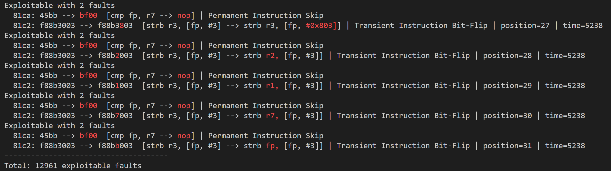

[](https://lbesson.mit-license.org/)


# Navigation
1. [Introduction](#introduction)
2. [Running The Example](#build-instructions)
3. [Using ARMORY in Your Own Projects](#quickstart)
4. [Academic Context](#academic-context)

# Welcome to ARMORY! <a name="introduction"></a>

ARMORY is our fully automated exhaustive fault simulator for ARM-M binaries, developed for our paper **"ARMORY: Fully Automated and Exhaustive Fault Simulation on ARM-M Binaries"**.

Given a binary, a set of fault models to inject, and an exploitability model, ARMORY exhaustively finds all exploitable faults via simulation, automatically utilizing all available CPU cores.
ARMORY is based on M-Ulator, our own emulator for the ARMv6-M and ARMv7-M families, beating state-of-the-art emulator Unicorn in performance and, when it comes to invalid Assembly, also in correctness.

Here is an example of the output of ARMORY:



# Running The Example <a name="build-instructions"></a>

ARMORY is build using the meson build system (install via `pip3 install meson`).
You also need the ARM gcc toolchain to build and read ARM binaries (install via  `sudo apt install gcc-arm-none-eabi`).
To build ARMORY and run an example, simply
1. clone this git
2. `python3 run_example.py`

You can also easily play around with the example by modifying `src/main.cpp`.
Try out multivariate fault injection by injecting each model twice ;)
Note that this will produce quite some output, so you may want to pipe the output to a file.
By default, progress information is printed to stderr and results are printed to stdout.

## Using ARMORY in Your Own Projects <a name="quickstart"></a>
1. clone this git
2. copy the modules you would like to use from the `subprojects` directory into your own meson `subprojects` directory
3. in your `meson.build` file, pull in the dependencies you need via
    * `libmulator_dep = subproject('m-ulator').get_variable('libmulator_dep')`
    * `libarmory_dep = subproject('armory').get_variable('libarmory_dep')` (includes M-ulator)
    * `libfault_simulator_dep = subproject('fault_simulator').get_variable('libfault_simulator_dep')` (includes ARMORY and M-ulator)
4. add the dependency to your projects' `dependencies` variables

It's best to take a look at the example in `src/main.cpp` to get a quick overview on how to use ARMORY.
Our `fault_simulator` wrapper around ARMORY makes it easy to prepare everything you need in just a few steps.

For a more complex application of ARMORY, take a look at the code we used for the experiments in our publication.
This code can be found in a different [repository](https://github.com/emsec/arm-fault-simulator-paper-results).


# Academic Context <a name="academic-context"></a>

If you use ARMORY or M-ulator in an academic context, please cite our paper using the reference below:
```latex
@article {
    todo
}
```

## Reproducing the experiments from our paper
The code that was used for the experiments in our paper and all the report files and visualizations are available in a separate [repository](https://github.com/emsec/arm-fault-simulator-paper-results).
The code there will not be updated to retain reproducibility.


# Known Issues
- M-Ulator:
    - ARMv6-M unsupported instructions:
        - MSR/MRS
        - CPS
        - SVC
    - ARMv7E-M (DSP extension) not implemented
    - floating point extension not implemented
    - privilege modes not implemented (i.e., always unprotected access)
    - exceptions/interrupts not implemented

- ARMORY:
    - None
